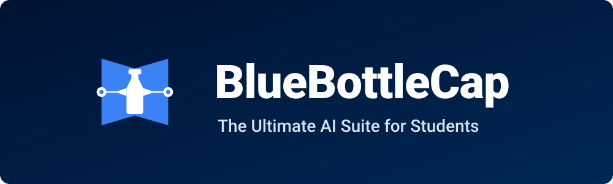
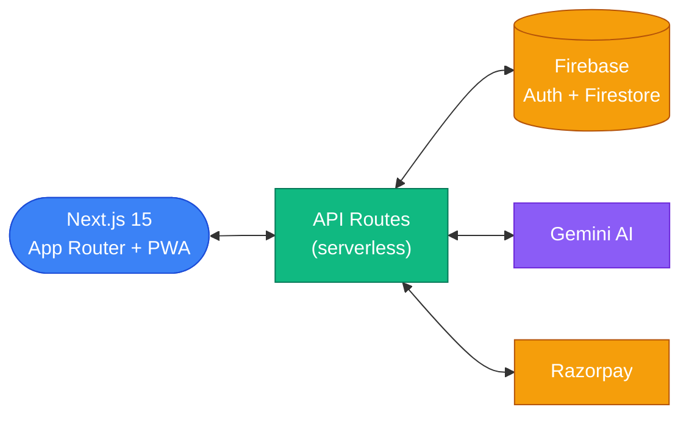
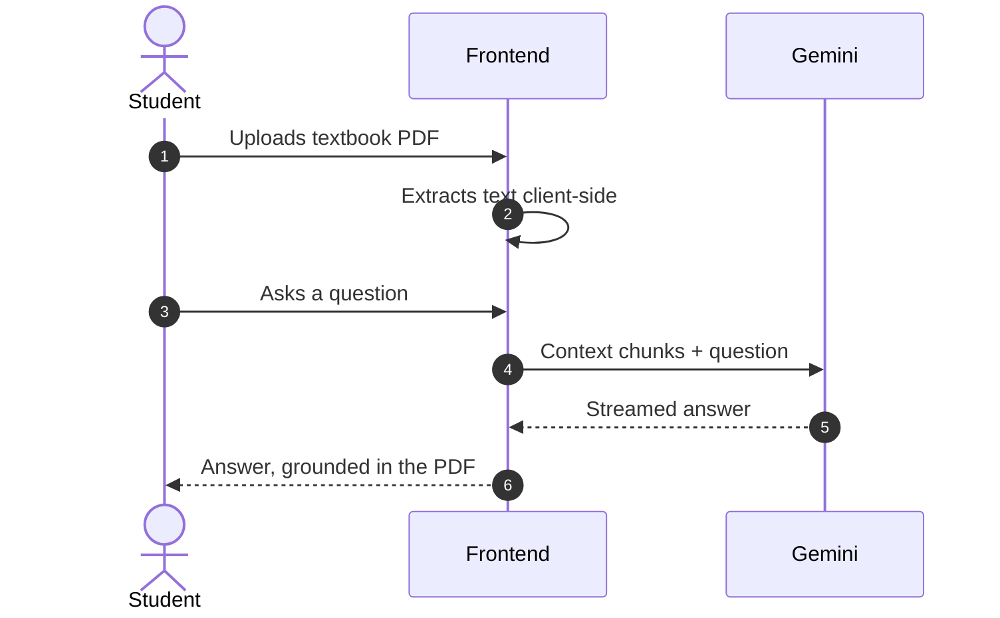

<div align="center">
  

  <br />

  

  <p><strong>The AI study workspace for JEE, GATE & B.Tech</strong> — live at <a href="https://bluebottlecap.com">bluebottlecap.com</a></p>

  <p>
    <a href="https://github.com/divyanshus2404/BlueBottleCap-Saas/issues?q=is%3Aissue+is%3Aopen+label%3A%22good+first+issue%22"></a>
    <a href="https://github.com/divyanshus2404/BlueBottleCap-Saas/issues"></a>
    <a href="https://github.com/divyanshus2404/BlueBottleCap-Saas/pulls"></a>
    <a href="LICENSE"></a>
  </p>
</div>

<br />

## What it does

| Tool | In one line |
|------|-------------|
| 📄 **PDF Copilot** | Upload a textbook, ask it questions, get answers grounded in *your* pages |
| 📝 **Mock Tests** | AI-generated papers that mimic real JEE difficulty, with scoring & review |
| 🗂 **Flashcards** | Turn any chapter into a spaced-repetition deck in seconds |
| 📅 **Study Planner** | Feed it your syllabus + exam dates, get a day-by-day plan |
| 🔥 **Streaks & Leaderboard** | Daily streaks, streak-saves, and friendly competition |
| 📱 **Installable PWA** | Under 1 MB, works offline, installs straight from the browser |

## How it works



The PDF Copilot flow, end to end:



## Tech stack

<div align="center">

  
  
  
  
  
  
  

</div>

## Run it locally

```sh
git clone https://github.com/divyanshus2404/BlueBottleCap-Saas.git
cd BlueBottleCap-Saas
npm install
cp .env.example .env.local   # add your keys (see below)
npm run dev                  # → http://localhost:3000
```

You'll need Node 18+, a [Gemini API key](https://aistudio.google.com/apikey), and a free [Firebase project](https://console.firebase.google.com) (Auth + Firestore). Razorpay keys are only needed for payment flows.

## Contributing — start here 👋

This repo is **actively looking for contributors**, and beginner PRs are genuinely welcome.

1. Pick an issue labeled [`good first issue`](https://github.com/divyanshus2404/BlueBottleCap-Saas/issues?q=is%3Aissue+is%3Aopen+label%3A%22good+first+issue%22) — each one says exactly which files to touch and how
2. Comment on it to claim it (so two people don't do the same work)
3. Fork → branch → PR. Details in [CONTRIBUTING.md](CONTRIBUTING.md)

Bigger appetite? Check [`help wanted`](https://github.com/divyanshus2404/BlueBottleCap-Saas/issues?q=is%3Aissue+is%3Aopen+label%3A%22help+wanted%22) — dark mode, test coverage, performance work.

## Contributors

<a href="https://github.com/divyanshus2404/BlueBottleCap-Saas/graphs/contributors">
  
</a>

## License

MIT — see [LICENSE](LICENSE). Built by [Divyanshu Singh](https://github.com/divyanshus2404).
