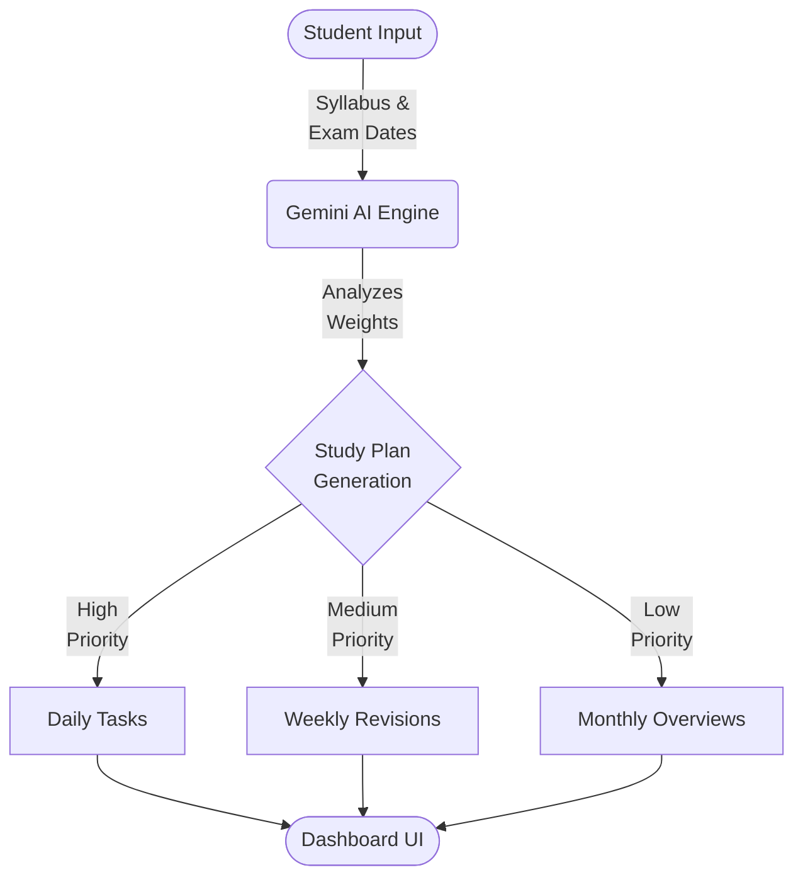
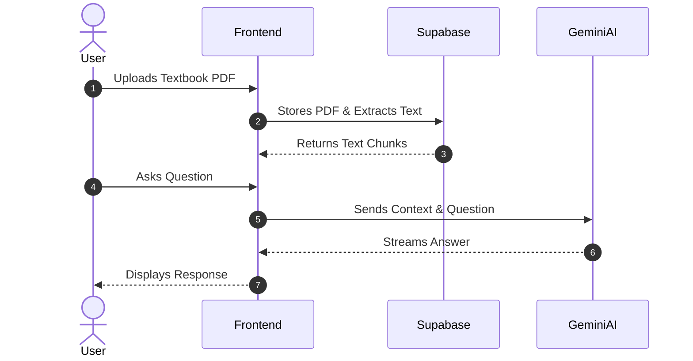
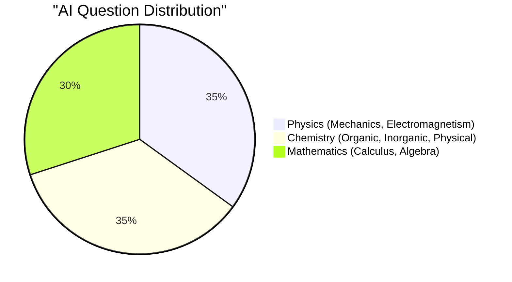
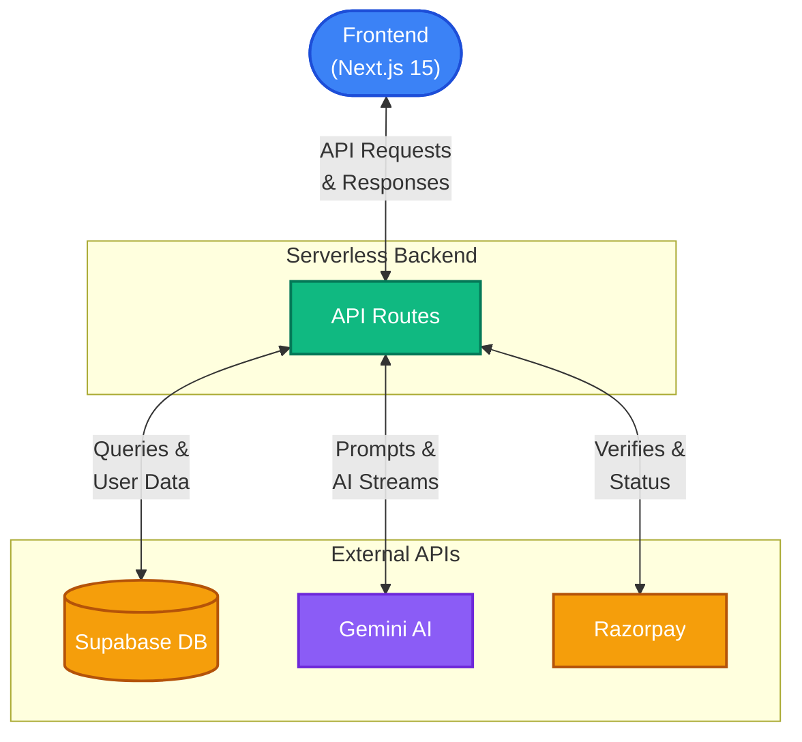

<div align="center">
  
  
  <br />
  
  <a href="https://github.com/divyanshus2404/BlueBottleCap-Saas">
    
  </a>

  <p>An Advanced AI Suite and SaaS Platform powered by Next.js, Google Gemini, and Supabase.</p>

  <p>
    <a href="https://github.com/divyanshus2404/BlueBottleCap-Saas/issues"></a>
    <a href="https://github.com/divyanshus2404/BlueBottleCap-Saas/pulls"></a>
    <a href="https://github.com/divyanshus2404/BlueBottleCap-Saas/blob/main/LICENSE"></a>
  </p>
</div>

---

## 🌟 About The Project

**BlueBottleCap SaaS** is a modern, feature-rich platform designed to deliver powerful AI-driven tools directly to students. Whether you're planning your semester, creating flashcards, or solving complex JEE physics problems, BlueBottleCap uses state-of-the-art AI to supercharge your learning.

<p align="center">
  
</p>

## ⚙️ Core AI Workflows

### 1. B.Tech Study Planner
The study planner analyzes your syllabus and automatically allocates time across your semester.



### 2. PDF Copilot
Upload any PDF and chat with it instantly. The AI reads the context and answers questions specifically from the document.



### 3. JEE Question Generator
Generates practice questions that mimic the difficulty and style of previous years' papers.



<p align="center">
  
</p>

## 🏛 System Architecture

The entire platform is built on a highly scalable, serverless architecture using modern web technologies.



---

## 🛠 Tech Stack

<div align="center">
  
  
  
  
  
  
  
  
</div>

---

## 🚀 Getting Started

Follow these steps to get the primary AI Suite up and running on your local machine.

### Prerequisites

You need [Node.js](https://nodejs.org/) (v18+) and npm installed.

### Installation

1. **Clone the repository**
   ```sh
   git clone https://github.com/divyanshus2404/BlueBottleCap-Saas.git
   cd BlueBottleCap-Saas
   ```

2. **Install NPM packages**
   ```sh
   npm install
   ```

3. **Configure Environment Variables**
   Create a `.env.local` file at the root (or copy `.env.example`) and add your API keys:
   ```env
   GEMINI_API_KEY=your_gemini_api_key_here
   NEXT_PUBLIC_SUPABASE_URL=your_supabase_url
   NEXT_PUBLIC_SUPABASE_ANON_KEY=your_supabase_anon_key
   ```

4. **Run the development server**
   ```sh
   npm run dev
   ```
   Open `http://localhost:3000` to view the app in your browser!

---

## 🤝 Contributing

Contributions are what make the open source community such an amazing place to learn, inspire, and create. Any contributions you make are **greatly appreciated**.

Please read our [Contributing Guidelines](CONTRIBUTING.md) for details on our code of conduct, and the process for submitting pull requests to us.

1. Fork the Project
2. Create your Feature Branch (`git checkout -b feature/AmazingFeature`)
3. Commit your Changes (`git commit -m 'Add some AmazingFeature'`)
4. Push to the Branch (`git push origin feature/AmazingFeature`)
5. Open a Pull Request

---

## 📜 License

Distributed under the MIT License. See `LICENSE` for more information.

---

## 👨‍💻 Author

**Divyanshu Singh** - [GitHub Profile](https://github.com/divyanshus2404)
